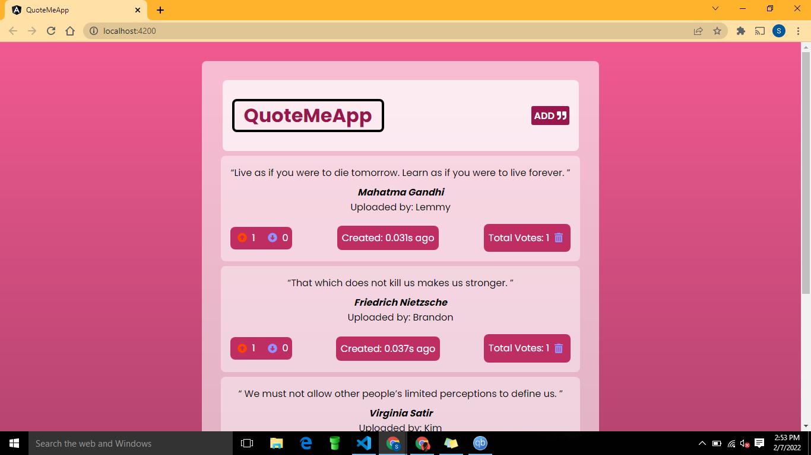

# QuoteMeApp

Quote App project. 
This project was generated with [Angular CLI](https://github.com/angular/angular-cli) version 13.2.0.

## Table of contents
  - [Screenshot](#screenshot)
  - [Project-Details](#Project-Details)
  - [Contact Information](#contact-information)
  - [License & Copywright Information](#License-and-Copywright-Information)
  - [Author](#author)
---
___

### Screenshot

---
___

### BDD
 #### Context
   Given that the user adds a quote, the Authors name, and his User name,\
      And the name(s) are valid,\
      And the quote is valid,
 #### Event
  When the User clicks the submit button
#### Outcomes
  Then the app should add the quote to the list of quotes present

* [x] User Inputs Quote, Author's name and his/her name.
* [x] Submit button Starts the app.
* [x] Form validity checks are done.
* [x] Custom pipe calculates time since quote was created.
* [x] Directive highlights most liked quote.

---

### Project-Details
## Development server

Run `ng serve` for a dev server. Navigate to `http://localhost:4200/`. The app will automatically reload if you change any of the source files.

## Code scaffolding

Run `ng generate component component-name` to generate a new component. You can also use `ng generate directive|pipe|service|class|guard|interface|enum|module`.

## Build

Run `ng build` to build the project. The build artifacts will be stored in the `dist/` directory.

## Running unit tests

Run `ng test` to execute the unit tests via [Karma](https://karma-runner.github.io).

## Running end-to-end tests

Run `ng e2e` to execute the end-to-end tests via a platform of your choice. To use this command, you need to first add a package that implements end-to-end testing capabilities.

## Further help

To get more help on the Angular CLI use `ng help` or go check out the [Angular CLI Overview and Command Reference](https://angular.io/cli) page.

---
___
### Contact Information

| Name   | Email               |
|--------|---------------------|
| Email  | lemmymwaura@gmail.com |
| Twitter| lemmyMwaura |
| Github | [lemmyMwaura](https://github.com/LemmyMwaura) |
---
___
### License and Copywright Information
(c) Stephen Lemmy Mwaura, Software Engineer.

Licensed under the [MIT License](LISENCE)

---
___
## Author 
Hi there, I'm Lemmy and i love to code. Connect With me:

- 💻 Project Website - [Quote me App](https://lemmymwaura.github.io/quoteMe-App/)
- 🎱 Github - [@lemmyMwaura](https://github.com/LemmyMwaura)

---
___